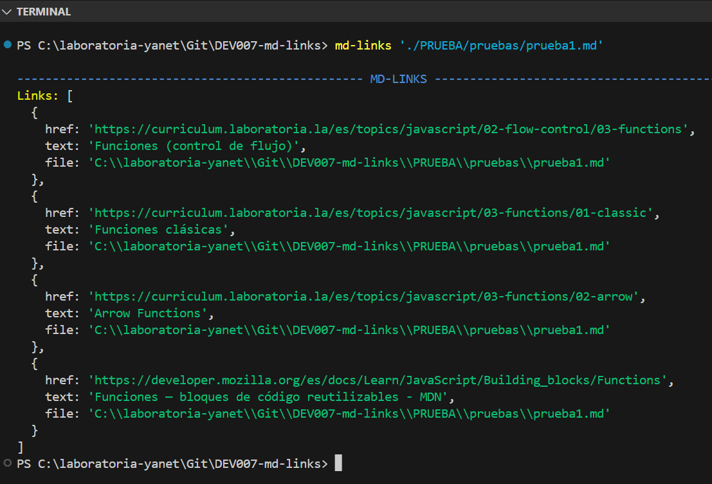
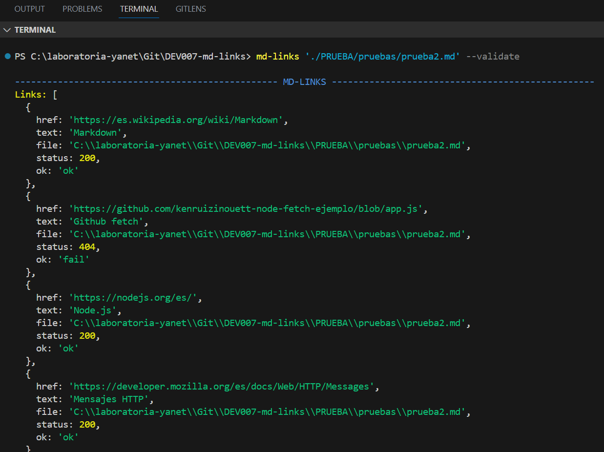
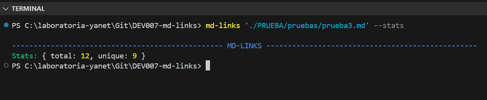
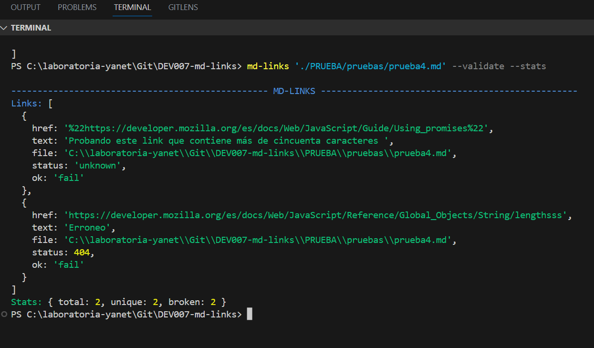
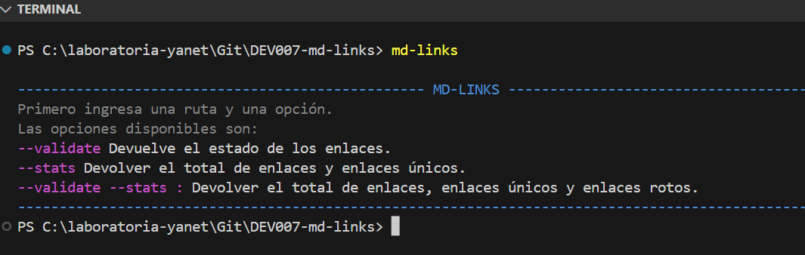
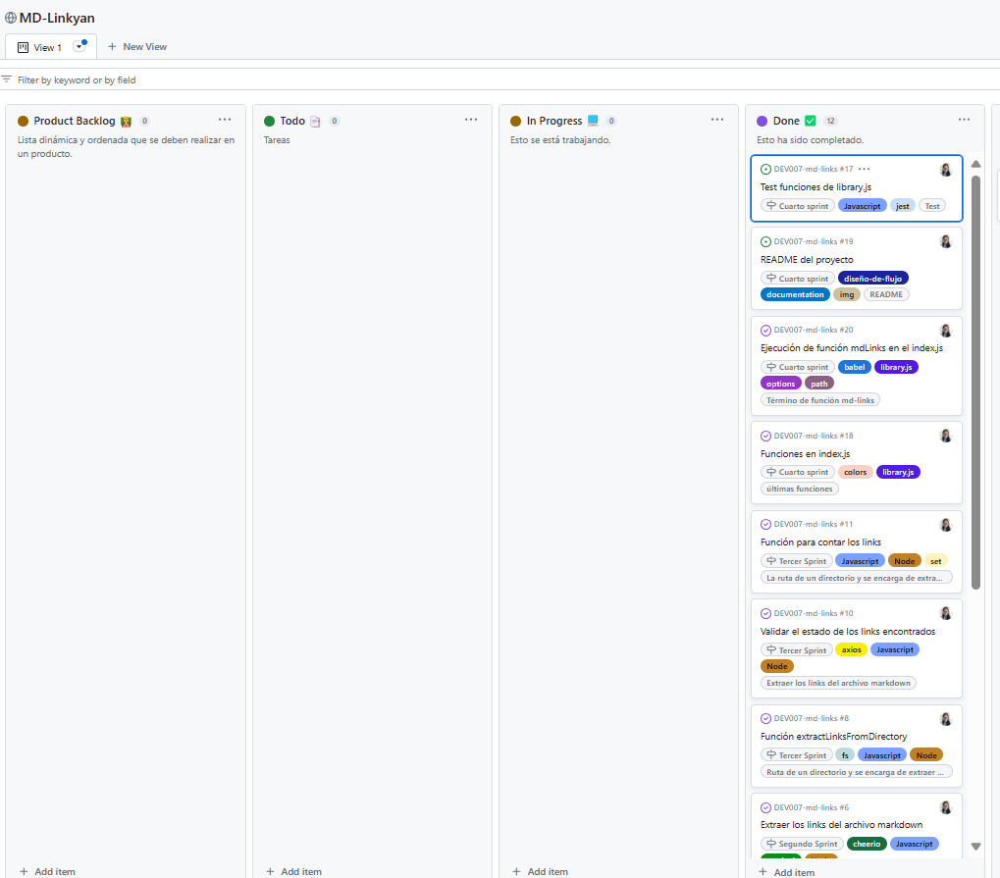

# MD-Linkyan

## Índice

* [1. Introducción](#1-Introducción)
* [2. Resumen del proyecto](#2-resumen-del-proyecto)
* [3. Instalación](#3-instalacion)
* [4. Diagrama de flujo](#4-diagrama-de-flujo)
* [5. Comandos](#5-comandos)

***
## 1. Introducción
Este proyecto consiste en crear una herramienta **Md-Links** que es una libreria que te permite leer y analizar archivos en formato `Markdown`, para verificar los links que contengan y reportar algunas estadísticas incluyendo si son válidos o no, con solo ingresar una ruta, además de proporcionar una herramienta de línea de comando (CLI).

## 2. Resumen del proyecto
El objetivo es crear una herramienta utilizando [Node.js](https://nodejs.org/) para analizar archivos en formato Markdown y verificar los links que contienen. La herramienta proporcionará estadísticas sobre los links encontrados, como la cantidad total de links, la cantidad de links únicos y la cantidad de links rotos o no válidos.

Esta herramienta será útil para desarrolladores y comunidades de código abierto, ya que les permitirá identificar y corregir los links rotos en sus archivos Markdown, lo que mejorará la calidad y utilidad de la información compartida en plataformas como GitHub, foros y blogs.

El proceso general de la herramienta será el siguiente:

Recibir como entrada una ruta de archivo o directorio que contiene archivos Markdown a analizar.
Leer el contenido de los archivos Markdown.
Extraer los links encontrados en cada archivo y almacenarlos en una lista.
Si se proporciona la opción --validate, verificar la validez de cada link realizando una solicitud HTTP para comprobar su estado.
Mostrar los resultados en la consola, incluyendo los links encontrados y las estadísticas (cantidad total, cantidad de links únicos y cantidad de links rotos).
Con esta herramienta, los desarrolladores podrán mantener sus archivos Markdown actualizados y corregir cualquier link roto, lo que mejorará la confiabilidad y utilidad de la documentación y la información compartida en su comunidad de código abierto.

 ## 3.Instrucciones de uso

 Las siguientes instrucciones le permitirán instalar la biblioteca en su terminal.
## 4. Instalación
La instalación se puede realizar por npm:

<<<<<<< readme
```
$ `npm i md-links`
```
=======

>>>>>>> main

 ### 4.2 Interfaz de Linea de Comando (CLI) ⚙️

Se ejecuta de la siguiente manera a través del terminal:

```
$ mdLinks <path> [options]
```

 Ejemplo:

```
$ mdLinks <path>
```




#### 2.2.1 Opciones

**--validate**
Al ingresar el comando `md-links path --validate`el módulo hace una petición HTTP para averiguar si el link funciona o no, retonando las siguientes propiedades.

```
$ mdLinks <path> --validate
```
 

**--stats**
Si pasamos la opción `--stats` el output (salida) obtenemos un texto con estadísticas básicas sobre los links, como el número total de links y links únicos.

```
$ mdLinks <path> --stats
```


**--validate --stats** **--stats --validate**
Si pasamos la opción `--validate` y `--stats` o Si pasamos la opción `--stats` y `--validate` nos retornara las estadísticas de los links totales, únicos y rotos.

```
$ mdLinks <path> --validate --stats
```


**md-links**
Si pasamos la opción `md-links` nos retornará instrucciones acerca de los comandos.

```
$ md-links 
```


## 5. Diagrama de flujo


## 6.  Project gitHub



### 7.- Referencias utilizadas<br>

- [File-Sytem](https://nodejs.org/api/fs.html)
- [Path module](https://www.npmjs.com/package/path) aquí esta la documentación (https://nodejs.org/api/path.html)
- [axios]( https://www.npmjs.com/package/axios) aquí esta la documentación (https://axios-http.com/docs/intro) 
- [chalk](https://www.npmjs.com/package/chalk) 
- [marked](https://www.npmjs.com/package/markedy) aquí esta la documentación (https://marked.js.org/) 
- [cheerio](https://www.npmjs.com/package/cheerio) aquí esta la documentación (https://cheerio.js.org/docs/intro)

### 8.- Crédito

<div align = "center">
  <!-- Gmail -->
  <a href="mailto:yanettr2023@gmail.com" target="_blank">
    
  </a>
  <!-- Linkedin -->
  <a href="https://www.linkedin.com/in/yanet-toribio/" target="_blank">
    
  </a>	  	  
</div>
