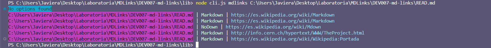
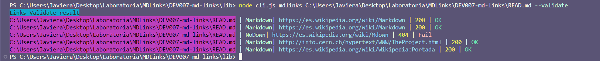
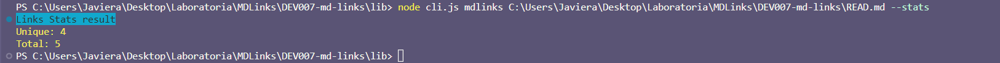
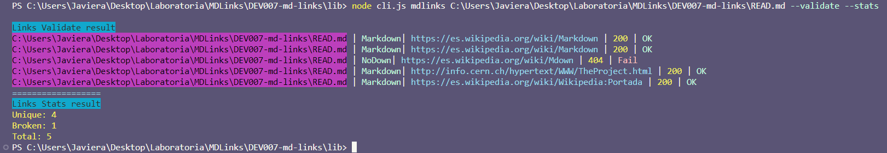

## MDLinks - Validador de Enlaces en Archivos Markdown

 

MDLinks CLI es una herramienta de línea de comandos desarrollada en Node.js que permite validar enlaces en archivos Markdown. Puede recibir tanto archivos individuales como carpetas como entrada y verificar los enlaces presentes en ellos. A continuación, se detallan los comandos disponibles, cómo usarlos y las tecnologías utilizadas en el proyecto.

## Instalación

Para utilizar MDLinks, debes seguir los siguientes pasos de instalación:

1. Abre una terminal y psiciónate en la carpeta donde quieras realizar la instalación.

2. Instala MDLinks globalmente utilizando npm con el siguiente comando:

##### `npm i md-links-jg`

## Instrucciones: 

####MDLinks CLI

MDLinks CLI ofrece varios comandos para analizar y validar enlaces en archivos Markdown. A continuación se detallan los comandos disponibles y cómo usarlos.

#####Para el comando sin opciones:

###`node cli.js mdlinks example.md`

##### #Resultado

Imprime una lista de enlaces en el archivo sin realizar validación.

 

#####Para el comando para validaciones:

####`node cli.js mdlinks example.md --validate`

##### Resultado
Imprime una lista de enlaces en el archivo con su estado (ok o Fail) y el código de estado HTTP.

 

#####Para el comando para estadísticas:

####`node cli.js mdlinks example.md --stats`

##### Resultado
Imprime estadísticas sobre los enlaces encontrados en el archivo, incluyendo el número total de enlaces y enlaces únicos.

 

#####Para el comando de validaciones + estadísticas:

####`node cli.js mdlinks example.md --validate --stats`

##### Resultado
Imprime estadísticas sobre los enlaces encontrados en el archivo, incluyendo el número total de enlaces, enlaces únicos y enlaces rotos.

 

## Detalle de valores de retorno

La función debe **retornar una promesa** (`Promise`) que **resuelva a un arreglo**
(`Array`) de objetos (`Object`), donde cada objeto representa un link y contiene
las siguientes propiedades

Con `validate:false` :

* `href`: URL encontrada.
* `text`: Texto que aparecía dentro del link (`<a>`).
* `file`: Ruta del archivo donde se encontró el link.

Con `validate:true` :

* `href`: URL encontrada.
* `text`: Texto que aparecía dentro del link (`<a>`).
* `file`: Ruta del archivo donde se encontró el link.
* `status`: Código de respuesta HTTP.
* `ok`: Mensaje `fail` en caso de fallo u `ok` en caso de éxito.

Con `stats:false` :

* `Total`: Total de links encontrados.
* `Unique`: Links  únicos, no repetidos.

Con `stats:false` :

* `Total`: Total de links encontrados.
* `Unique`: Links  únicos, no repetidos.

Con `stats:true` :

* `Total`: Total de links encontrados.
* `Unique`: Links  únicos, no repetidos.
* `Broken`: Links rotos.

## 4. Tecnologías utilizadas
***Node.js:*** Plataforma para construir aplicaciones de red escalables.

***JavaScript: ***Lenguaje de programación ampliamente utilizado para el desarrollo web.

***npm:*** Gestor de paquetes de Node.js para instalar y administrar dependencias.

***Jest:** *Framework de pruebas para asegurar la calidad del código.

------------

*Todos los derechos reservados a Javiera Gandarillas*
