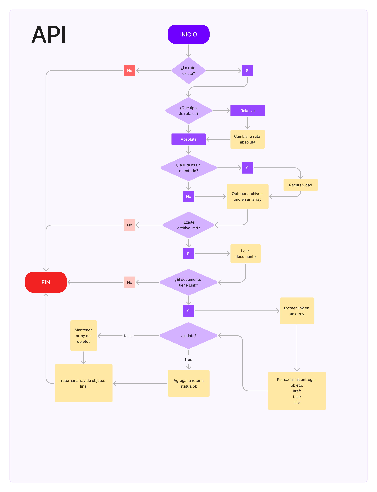
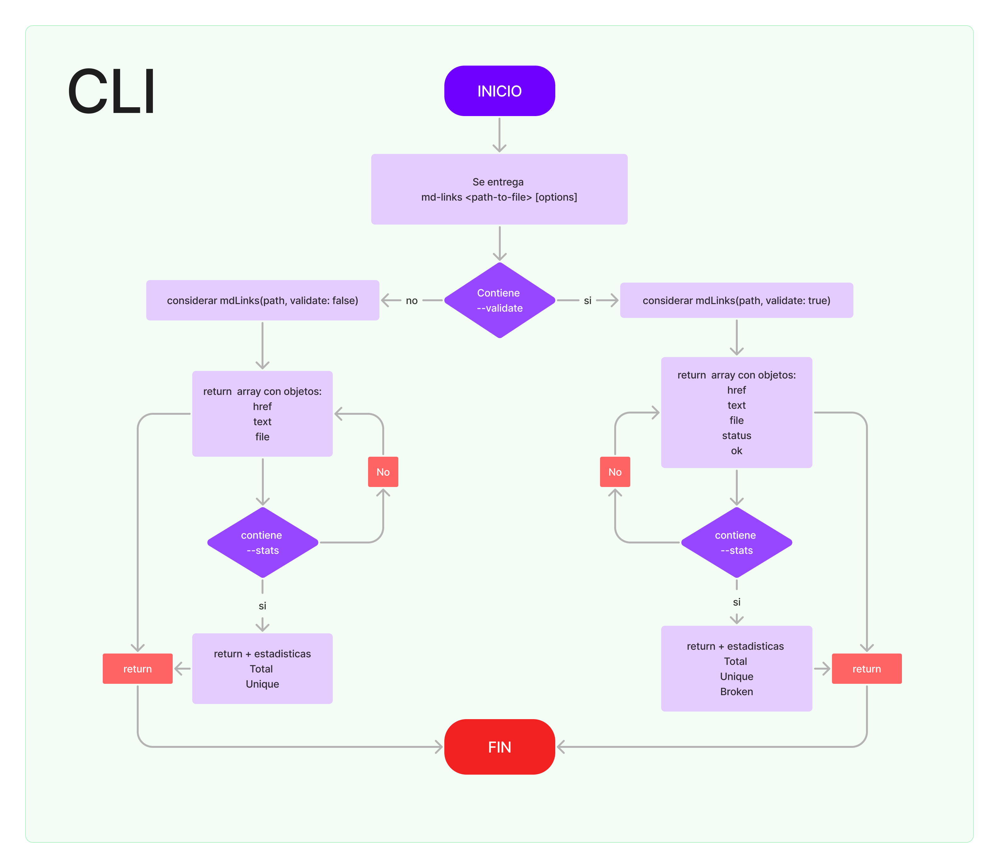

# Markdown Links

## Índice

- [Markdown Links](#markdown-links)
  - [Índice](#índice)
  - [1. Resumen de herramienta](#1-resumen-de-herramienta)
  - [2. Diagrama de flujo](#2-diagrama-de-flujo)
    - [A.- API](#a--api)
    - [B.- CLI](#b--cli)
  - [3. Board](#3-board)
  - [4. Documentacion técnica de la libreria](#4-documentacion-técnica-de-la-libreria)
  - [5. Guía de uso e instalación de la librería](#5-guía-de-uso-e-instalación-de-la-librería)

***

## 1. Resumen de herramienta
[Markdown](https://es.wikipedia.org/wiki/Markdown) es un lenguaje de marcado ligero muy popular entre developers. Es usado en muchísimas plataformas que manejan texto plano (GitHub, foros, blogs, ...) y es muy común encontrar varios archivos en ese formato en cualquier tipo de repositorio (empezando por el tradicional `README.md`).

Estos archivos `Markdown` normalmente contienen _links_ (vínculos/ligas) que muchas veces están rotos o ya no son válidos y eso perjudica mucho el valor de la información que se quiere compartir.

Esta herramienta de línea de comando (CLI) tiene como objetivo revisar los archivos `.md` y verificar si contienen _links_ y a su vez indicar si estos son validos o no. 

## 2. Diagrama de flujo

### A.- API

### B.- CLI

## 3. Board
## 4. Documentacion técnica de la libreria
## 5. Guía de uso e instalación de la librería
