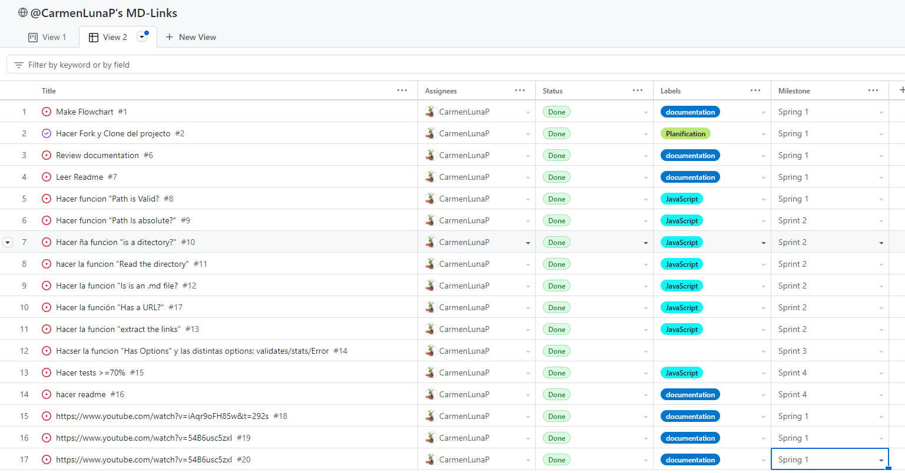
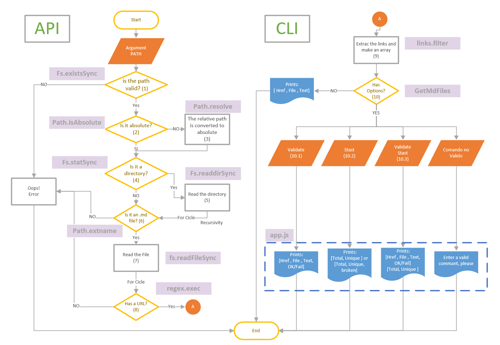
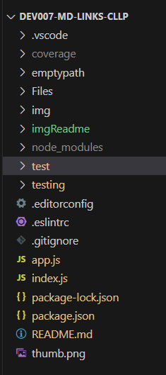

.
# Markdown Links

## Index.

* [1. Summary](#1-Summary)
* [2. Resumen del proyecto](#2-resumen-del-proyecto)
* [3. Planning](#3-Planning)
* [3. Flowchart Project](#3-Flow)
* [5. Boilerplate](#5-Boilerplate)
* [6. Boilerplate](#6-Boilerplate)
* [7. Technical Documentation of the Library](#6-Documentation)
* [8. Teamwork](#7-Teamwork)
* [9. Checklist](#9-checklist)

***
Technical Documentation of the Library

## 1. Summary

This project is the fourth project of Dev-007 from Latobaria. In this opportunity, I am to develop a tool using [Node.js](https://nodejs.org/). that will enable reading, validation, and analysis of files in Markdown format.

[Markdown](https://es.wikipedia.org/wiki/Markdown) is a lightweight markup language widely popular among developers. It is extensively used on various platforms that handle plain text (such as GitHub, forums, blogs, etc.), and it is very common to come across multiple files in this format in any repository, starting with the traditional README.md

These Markdown files typically contain links that often end up broken or invalid, significantly diminishing the value of the information being shared.

## 2. About Project.

Laboratoria proposes to create a tool using the Node.js runtime environment that can read .md files, even when they are inside a directory. The tool should extract the existing links from these files and check if they are functional. Additionally, it should provide certain statistics. In summary, the project involves creating a command-line tool (CLI) and a custom JavaScript library (library).

## 3. Planning.

The project was developed in 4 sprints, and the planning and tracking were carried out using GitHub Project, as shown below:

## 4. Flowchart Project.

## 5. Guide for usage and installation of the library.

*Installation*

To install the library, follow these steps:

1) Open the terminal of your operating system.

2) Navigate to the root directory of your project or the location where you want to install the library.

3) Execute the following command in the terminal to install the library from the npm package registry:
  
       npm install <carmenl-md-links>

   Once the installation is complete, you can import and use the library in your project according to the usage instructions provided in the usage guide.

By following these steps, you will have installed the library in your project and will be able to start using it to perform the desired tasks.

*Usage Instructions*

The tool's executable is used as follows through the terminal: 

*mdLinks < path-to-file > [options]*

1) path: Argument that indicates the tool the path of the file you want to check. This path can be relative or absolute.

2) options: Argument that allows you to specify certain features to evaluate:

* --validate: The module will make an HTTP request to check if the link works or not.

* --stats: If we pass the --stats option, the output will be a text with basic statistics about the links, including the total number of links and the total number of unique links.

* --validate --stats: It will deliver comprehensive statistics that also include "broken" links, which are links that are not working or invalid.

## 6. Boilerplate

* README.md: This file contains a description of the module, installation/usage instructions, API documentation, and examples.
* index.js: From this file, you should export the mdLinks function.
* app.js: In this file, the mdLinks function is called, and the logic for delivering the code results according to the user's request is implemented.
* package.json: This file includes the name, version, description, authors, license, dependencies, scripts (pretest, test, ...), main, and bin.
* .editorconfig: This file contains configuration settings for text editors. It should not be modified.
* .eslintrc: This file contains configuration settings for the linter (ESLint). It provides a basic configuration for ESLint, but if you wish to add additional rules like Airbnb's, you will need to modify this file.
* .gitignore: This file is used to ignore certain folders, such as node_modules, that should not be included in version control (git).
test/md-links.spec.js: This file should contain the unit tests for the mdLinks() function. Your implementation must pass these tests.

## 7. Technical Documentation of the Library

Markdown is a lightweight markup language widely popular among developers. It is extensively used on various platforms that handle plain text (such as GitHub, forums, blogs, etc.), and it is very common to come across multiple files in this format in any repository, starting with the traditional README.md.

These Markdown files typically contain links that often end up broken or invalid, significantly diminishing the value of the information being shared.

The objective of this command-line tool (CLI) is to check .md files and verify if they contain links while indicating whether these links are valid or not.

The tool consists of two parts:

JavaScript API
The module must be importable into other Node.js scripts and should offer the following interface:
mdLinks(path, options)

Arguments:

* path: Absolute or relative path to the file or directory. If the path passed is relative, it should be resolved relative to the directory where node is invoked (current working directory).
* options: An object with only the following property:
* validate: A boolean that determines whether to validate the found links.
  Return Value:
The function should return a promise that resolves to an array of objects, where each object represents a link and contains the following properties:

With validate: false:

* href: The found URL.
* text: The text that appeared inside the link.
* file: The path of the file where the link was found.

With validate: true:

* href: The found URL.
* text: The text that appeared inside the link.
* file: The path of the file where the link was found.
* status: HTTP response code.
* ok: "fail" message in case of failure or "ok" in case of success.
CLI (Command Line Interface)
The executable of our application is run with the following command:
mdLinks <path-to-file> [options]

Options:

--validate: If we pass this option, the module must make an HTTP request to check if the link works or not. If the link results in a redirection to a URL that responds with an "ok" status, then we consider the link as "ok".

--stats: If we pass this option, the output will be text with basic statistics about the links, considering:
{Total: 3, Unique: 3}

We can also combine --stats and --validate to obtain statistics that depend on the validation results:
{Total: 3, Unique: 3, Broken: 1}

## 8. Teamwork

Carmen Luna - Frond End Developer

## 9. Checklist.

The following is a check of the objectives proposed by Laboratoria for the development of this project:

### General

* [x] Puede instalarse via `npm install --global <github-user>/md-links`

### `README.md`

* [x] Un board con el backlog para la implementación de la librería.
* [x] Documentación técnica de la librería.
* [x] Guía de uso e instalación de la librería

### API `mdLinks(path, opts)`

* [x] El módulo exporta una función con la interfaz (API) esperada.
* [x] Implementa soporte para archivo individual
* [x] Implementa soporte para directorios
* [x] Implementa `options.validate`

### CLI

* [x] Expone ejecutable `md-links` en el path (configurado en `package.json`)
* [x] Se ejecuta sin errores / output esperado
* [x] Implementa `--validate`
* [x] Implementa `--stats`

### Pruebas / tests

* [x] Pruebas unitarias cubren un mínimo del 70% de statements, functions,
  lines, y branches.
* [x] Pasa tests (y linters) (`npm test`).
