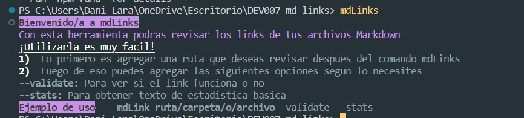
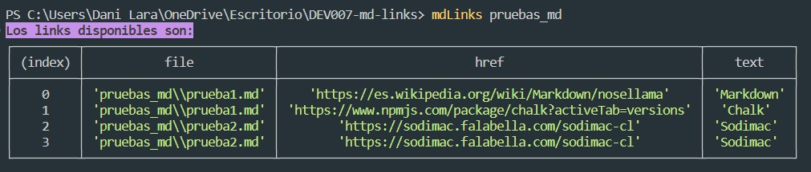
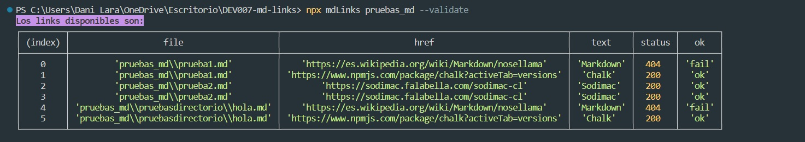
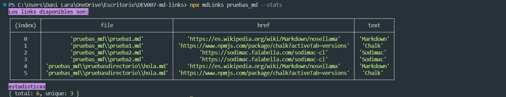
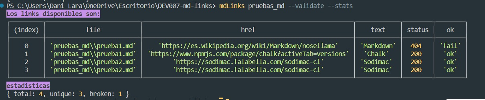

# Markdown Links

## Índice
- [Markdown Links](#markdown-links)
  - [Índice](#índice)
  - [1. Resumen de herramienta](#1-resumen-de-herramienta)
  - [2. Diagrama de flujo](#2-diagrama-de-flujo)
    - [A.- API](#a--api)
    - [B.- CLI](#b--cli)
  - [3. Board](#3-board)
  - [4. Documentacion técnica de la libreria](#4-documentacion-técnica-de-la-libreria)
  - [5. Guía de uso e instalación de la librería](#5-guía-de-uso-e-instalación-de-la-librería)
    - [instalacion global](#instalacion-global)
    - [Modo de Uso](#modo-de-uso)
      - [Ejemplos:](#ejemplos)
        - [mdLinks](#mdlinks)
        - [mdLinks + path](#mdlinks--path)
        - [mdLinks + path + options (una o ambas)](#mdlinks--path--options-una-o-ambas)

***

## 1. Resumen de herramienta
[Markdown](https://es.wikipedia.org/wiki/Markdown) es un lenguaje de marcado ligero muy popular entre developers. Es usado en muchísimas plataformas que manejan texto plano (GitHub, foros, blogs, ...) y es muy común encontrar varios archivos en ese formato en cualquier tipo de repositorio (empezando por el tradicional `README.md`).

Estos archivos `Markdown` normalmente contienen _links_ (vínculos/ligas) que muchas veces están rotos o ya no son válidos y eso perjudica mucho el valor de la información que se quiere compartir.

Esta herramienta de línea de comando (CLI) tiene como objetivo revisar los archivos `.md` y verificar si contienen _links_ y a su vez indicar si estos son validos o no. 

## 2. Diagrama de flujo

### A.- API

### B.- CLI

## 3. Board
## 4. Documentacion técnica de la libreria
## 5. Guía de uso e instalación de la librería

### instalacion global
### Modo de Uso

El ejecutable de nuestra aplicación se realiza de siguiente manera a través de la terminal:
 `mdLinks <path-to-file> [options]`

 1.- `mdLinks`: Con este comando comienzas a utilizar la Herramienta, te muestra una pequeña descripcion de su uso. 

 2.- `path`: Argumento con el cual le indicas a la herramienta la ruta del archivo que quieres revisar, esta ruta puede ser relativa o absoluta.
     - Al agregar este argumento sin `options` igualmente entregara un resumen de los links de la ruta consultada. 

 3.- `options`: Argumento con el cual le indicas a la herramienta si deseas evaluar ciertas caracteristicas: 
     - `--validate`: el módulo debe hacer una petición HTTP para averiguar si el link funciona o no.
     - `--stats` : Si pasamos la opción --stats el output (salida) será un texto con estadísticas básicas sobre los links, el cual contendra Total de links, y total de links sin repetir. 
         - `--stats` + `--validate`: entregara estadistica completa en la cual se agregara broken que son los archivos rotos o no validos.

#### Ejemplos: 

##### mdLinks 

##### mdLinks + path

##### mdLinks + path + options (una o ambas)

